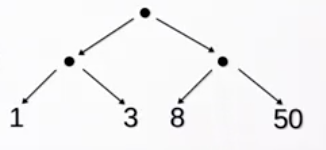
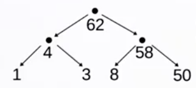

#### Parallel Scan (Prefix Sum) Operation
This is the video doing upsweep and downsweep on both trees and arrays.

The big idea is this: an intermediate data structure (the upsweep tree) used to perform a normally-sequential operation (scanLeft) in parallel.

Given an `a0` seed element, we can create a normal tree with the values to be folded at the Leaf level. In this case, the values to be folded are `List(1, 3, 8, 50)` into initial element `100`.

Given this tree, we can **upsweep** to compute (in parallel) an intermediate tree with the scan values still at leaves, and the summed values at the parent nodes. Parallelism is exploited by splitting workloads at Nodes, which is only available for balanced trees.

Before an upsweep:

New tree after:

Next step: **downsweep**, i.e. use this intermediate data structure to scanLeft in parallel! 

The key factor of this is that parallelism is enabled by passing down `preceding left results` to the subtrees for computation. For left subtrees, this is simply passing down the initial element (100), whereas for right subtrees the "left result" is just the initial element combined with the results of the left subtree: `downsweep[A](r, f(a0, l.res), f)`. Most importantly - **the right subtrees don't have to wait for the left subtrees to compute** - the upsweep tree provides enough information out of the gate for computation!

A similar story is told for Arrays - this "line of sight" problem is essentially prefix sum for Arrays, where `f` is the angle computation.

Note that upsweep creates a balanced tree, and downsweep requires that fact. The `ConcTree` stuff of Week 4 addresses problems where input trees are NOT balanced.

